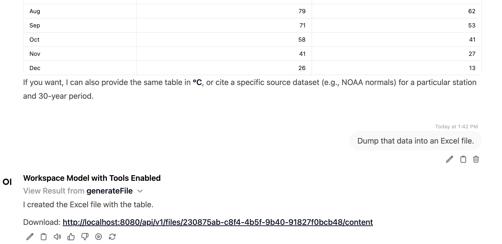
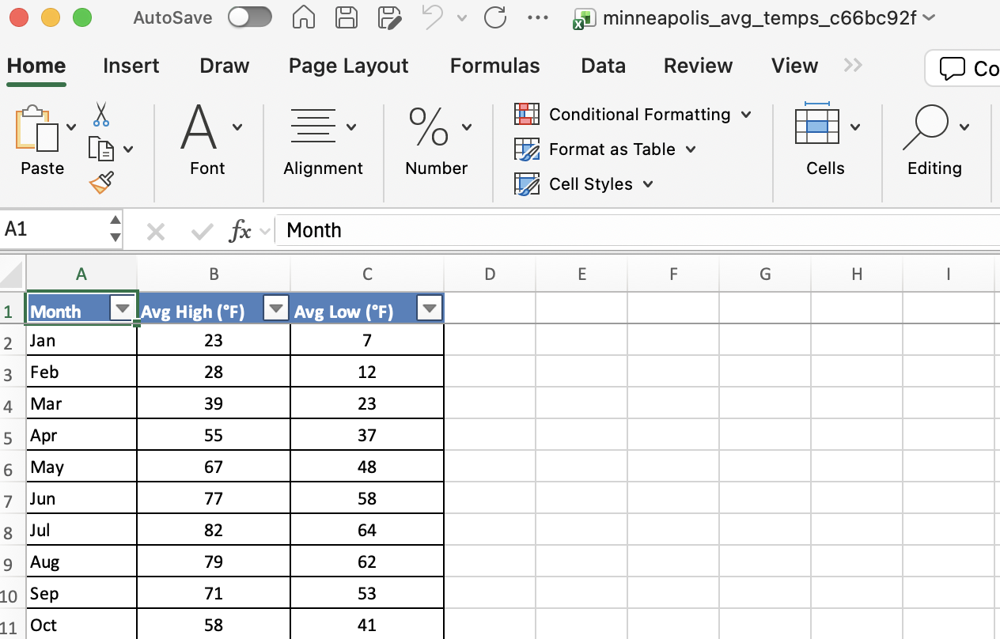
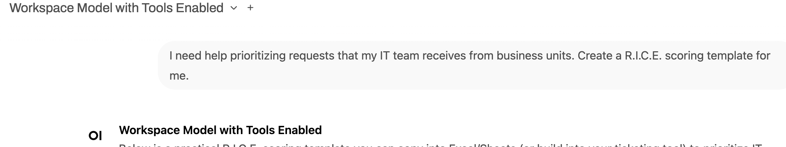
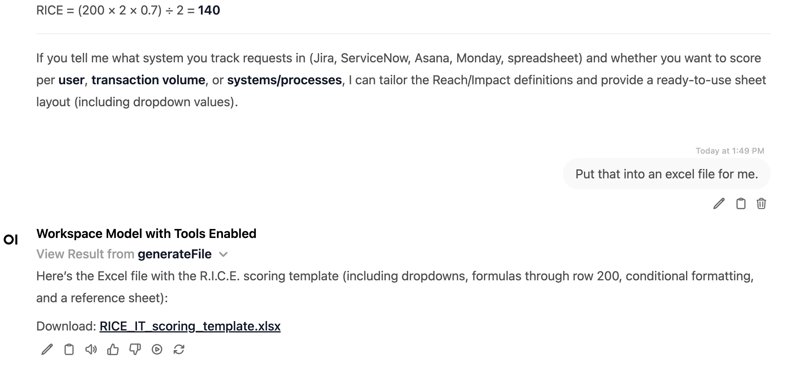
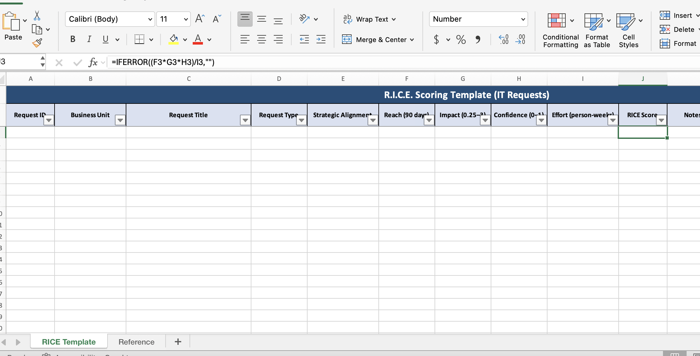
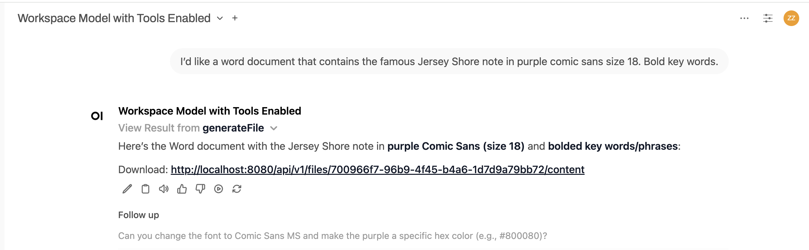
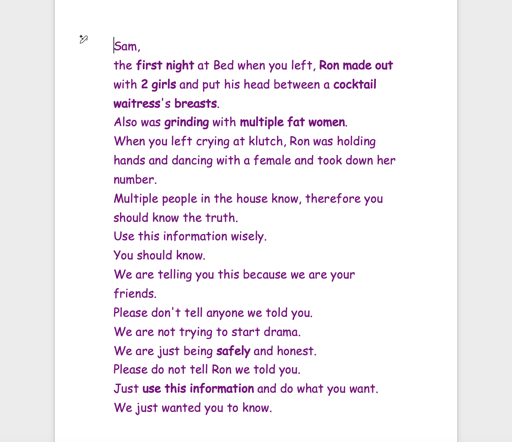

# OpenWebUI File Agent

A FastAPI service that generates Excel (`.xlsx`) and Word (`.docx`) files from natural language instructions. It uses an LLM to write Python code, executes it in a sandboxed subprocess, and uploads the result to Open WebUI.

## How It Works

1. You send a natural language instruction (e.g. *"Create a quarterly budget spreadsheet"*)
2. The service asks an LLM to generate Python code using `xlsxwriter` or `python-docx`
3. The code runs in an isolated subprocess (no access to API keys)
4. The resulting file is uploaded to Open WebUI
5. You get back a download URL

If the generated code fails, the service automatically retries up to 3 times, feeding the error back to the LLM for self-correction.

## Prerequisites

- **Docker** and **Docker Compose** or **Podman**
- An **LLM API key** (OpenAI, or any OpenAI-compatible endpoint)
- A running **Open WebUI** instance with an API key

## Quick Start

```bash
# 1. Clone the repository and navigate to
git clone <repo-url> && cd my_local_directory

# 2. Create your .env from the template
cp .sample_env .env

# 3. Fill in your API keys (see Configuration below)

# 4. Build and run
docker compose up --build
```

The service starts on **port 8000**. Verify it's running:

```bash
curl http://localhost:8000/health
# {"status":"ok"}
```

## Configuration

Copy `.sample_env` to `.env` and fill in the values:

```env
# LLM Configuration
OPENAI_API_KEY=sk-your-key-here
OPENAI_BASE_URL=https://api.openai.com/v1
MODEL_NAME=gpt-4o

# Subprocess
SCRIPT_TIMEOUT=90

# Open WebUI
INTERNAL_API_URL=http://host.docker.internal:8080
PUBLIC_DOMAIN=http://localhost:8080
OPENWEBUI_API_KEY=sk-your-openwebui-key-here
```

| Variable | Description |
|---|---|
| `OPENAI_API_KEY` | API key for the LLM provider |
| `OPENAI_BASE_URL` | LLM endpoint (works with OpenAI, Ollama, vLLM, etc.) |
| `MODEL_NAME` | Model to use for code generation |
| `SCRIPT_TIMEOUT` | Max seconds for generated code to execute (default: 90) |
| `INTERNAL_API_URL` | Open WebUI URL **from the service's perspective** (for file uploads) |
| `PUBLIC_DOMAIN` | Open WebUI URL **from the user's browser** (for download links) |
| `OPENWEBUI_API_KEY` | Open WebUI API key for file uploads |

## API Endpoints

### `POST /generate-file`

The primary endpoint. Generates a file from natural language instructions.

**Request:**

```json
{
  "instructions": "Create a monthly budget spreadsheet with categories for rent, utilities, food, and savings",
  "file_type": "excel",
  "filename_hint": "budget"
}
```

| Field | Type | Default | Description |
|---|---|---|---|
| `instructions` | string | *(required)* | Natural language description of the file to generate |
| `file_type` | string | `"excel"` | `"excel"` for `.xlsx` or `"docx"` for `.docx` |
| `filename_hint` | string | `"output"` | Base filename (a UUID suffix is added automatically) |

**Response:**

```json
{
  "status": "success",
  "download_url": "http://localhost:8080/api/v1/files/abc123/content",
  "message": "Excel file generated successfully.",
  "attempts": 1
}
```

### `GET /health`

Returns `{"status": "ok"}` if the service is running.

For development:

```bash
pip install -r requirements.txt
python main.py
```

This starts a single Uvicorn worker on port 8000. For production, use Docker which runs Gunicorn with 4 Uvicorn workers.

## Troubleshooting

| Symptom | Cause | Fix |
|---|---|---|
| `"No file found at file_path"` | LLM redefined `file_path` in generated code | Check debug logs; the regex stripping should handle this |
| `"Server disconnected"` / timeout | Gunicorn worker timeout too low | Increase `--timeout` in the Dockerfile CMD |
| `"Cannot connect to host localhost"` | Docker networking misconfiguration | Use `host.docker.internal` for `INTERNAL_API_URL` |
| Upload returns 401 | Invalid or missing Open WebUI API key | Regenerate key in Open WebUI Settings > Account > API Keys |
| Packages not found in subprocess | Wrong Python interpreter | Check the startup log `Python executable = ...` |

## Sample Conversations and Outputs

<!-- TODO: Add screenshots of sample conversations -->

### Excel Generation











### Word Document Generation




